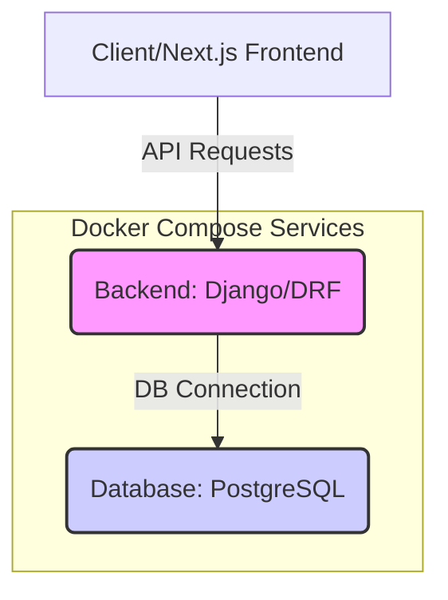

# SWIFT E-commerce Backend Architecture

This document outlines the architectural plan for the Django/DRF backend, designed to serve a decoupled Next.js frontend application.

## 1. Core Technologies

| Component | Technology | Version/Details | Purpose |
| :--- | :--- | :--- | :--- |
| **Base** | Python | 3.12.3 | Application runtime environment. |
| **Web Framework** | Django | Latest Stable (5.x) | Core backend framework. |
| **API** | Django Rest Framework (DRF) | Latest Stable | Building RESTful endpoints. |
| **Database** | PostgreSQL | Latest Stable | Robust, production-ready relational database. |
| **Containerization** | Docker/Docker Compose | Latest Stable | Environment isolation and orchestration. |

## 2. Authentication Strategy (Google OAuth + JWT)

Since the frontend is a separate Next.js application, we use JSON Web Tokens (JWT) for stateless authentication.

| Dependency | Purpose |
| :--- | :--- |
| `django-allauth` | Handles the complex Google OAuth flow, user registration, and account management. |
| `dj-rest-auth` | Provides RESTful endpoints for login, registration, and social authentication. |
| `djangorestframework-simplejwt` | Generates and manages JWT Access and Refresh tokens. |

### Authentication Flow

1.  The Next.js frontend initiates the Google OAuth flow, redirecting the user to Google.
2.  Google redirects the user back to a specific DRF endpoint (handled by `django-allauth` and `dj-rest-auth`).
3.  The DRF backend validates the authorization code, retrieves user data from Google, and creates/updates the local user account.
4.  The DRF backend issues a JWT (Access and Refresh token pair) back to the Next.js frontend.
5.  The Next.js frontend stores these tokens (e.g., in secure HTTP-only cookies) and includes the Access Token in the `Authorization: Bearer <token>` header for all subsequent API requests.

## 3. System Architecture (Docker Compose)

Docker Compose is used to manage the two primary services required for the backend to run: the application and the database.



## 4. Project Structure

The project will follow a standard Django structure, with a main configuration directory (`config`) and separate apps for core functionality (e.g., `users`, `products`, `orders`).

```
.
├── ARCHITECTURE.md
├── Dockerfile
├── docker-compose.yml
├── requirements.txt
├── .env.example
└── config/
    ├── settings.py
    └── urls.py
└── apps/
    └── users/
        ├── models.py
        └── ...
